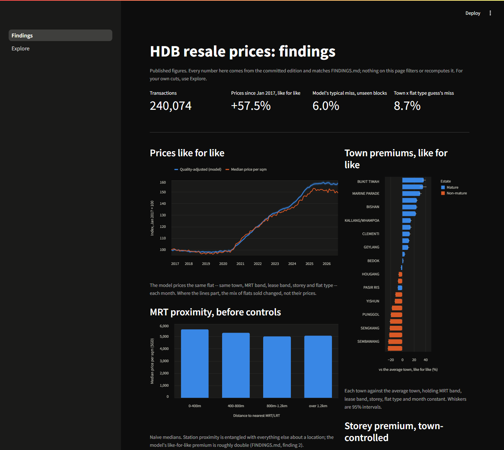

# HDB Resale Price Pipeline

[](https://github.com/yahweh9/hdb-resale-pipeline/actions/workflows/ci.yml)

Every HDB resale transaction since 2017, taken from a live public API to a tested
warehouse, and then through a pricing model that compares flats like for like.

It is built to show both halves of the job:

- **Data engineering:** incremental, idempotent ingestion, a dbt star schema on DuckDB,
  and data tests that fail the build.
- **Data analytics:** a hedonic pricing model, validated on blocks it never saw, and a
  findings document whose every table is generated from the same published numbers as
  the dashboard.

<!-- edition -->
**Data cut:** resale transactions through **Sep 2026** (240,074 sales) · published **14 Sep 2026**
<!-- /edition -->



---

## What the data says

The full analysis, with sample sizes and what each result cannot tell you, is in
[FINDINGS.md](FINDINGS.md).

- **Being near a station is worth about 19%, not 10%.** A group-by puts flats within
  400m of an MRT station 10.1% above those over 1.2km away. Comparing flats in the
  same town, with the same lease, storey, flat type and month, the premium is 18.9%.
  ([Finding 2](FINDINGS.md#2-the-mrt-premium-is-not-one-number--it-is-four))
- **Lease decay comes out backwards until location is held constant.** Grouped
  naively, 4-room flats with under 50 years left are the third most expensive lease
  band, because they are almost all in central, mature estates. Like for like, a
  lease that short costs about 43%.
  ([Finding 4](FINDINGS.md#4-lease-decay-comes-out-backwards-and-that-is-the-most-useful-result-here))
- **Prices rose about 57% like for like, nearly all of it after 2020.** The median's
  pause in 2026 came from which flats sold, not from what flats were worth.
  ([Finding 5](FINDINGS.md#5-prices-rose-52-almost-all-of-it-after-2020))
- **The model earns its place.** On blocks held out of the fit, it prices a typical
  sale within 6.0%, against 8.7% for a town x flat type median, and it is closer in
  every year. A dbt test fails the build if that stops being true.
  ([Finding 7](FINDINGS.md#7-which-blocks-sell-above-what-their-attributes-justify))
- **One hypothesis was tested and did not hold,** and is reported anyway: demand for
  large flats did not diverge by region.
  ([Finding 6](FINDINGS.md#6-a-hypothesis-that-was-tested-and-did-not-hold))

---

## How it works

```
 data.gov.sg · Wikidata · OneMap
              |
              v
 Python ingest -> bronze parquet, one immutable partition per month
              |
              v
 DuckDB + dbt: silver -> gold star schema -> hedonic model -> 13 marts
              |                              (dbt Python models)
              v
 publish_edition.py -> published/  (committed: the numbers a reader sees)
              |
      +-------+--------+
      v                v
 dashboard.py    the tables in FINDINGS.md
```

| | Engineering | Analytics |
|---|---|---|
| **Built** | Month-partitioned ingest with a high-water mark derived from the data; a star schema with the spatial attributes on the block dimension | `log(price_psm) ~ town + MRT band + lease band + storey + flat type + month`, fitted across all years (a price index) and per year |
| **Tested** | 105 dbt data tests; CI builds the whole warehouse from a committed fixture on every PR | Planted-answer tests on synthetic markets; build-failing gates for validation, fair value and coefficient sanity |
| **Served** | A committed edition, so the dashboard runs with no warehouse or API key | Every FINDINGS table generated and checked in CI; Explore's pandas checked against the SQL marts |

In numbers: 240,074 transactions, 9,744 geocoded blocks, 181 stations, 26 dbt models,
105 data tests and 90 pytest tests, all run on every pull request.

---

## Run it

The dashboard reads the committed edition, so it needs no API key, ingest or warehouse:

```bash
pip install -r requirements.txt
streamlit run dashboard.py
```

It has two pages: **Findings**, the published figures with no filters, and **Explore**,
the same descriptive figures recomputed under your own filters.

Rebuilding everything from the API, and running the pipeline offline as CI does, are
covered in [Running it](docs/ENGINEERING.md#running-it).

---

## Documents

| Document | For |
|---|---|
| [FINDINGS.md](FINDINGS.md) | What the data says, what it cannot, and the model's tables beside the group-by ones |
| [docs/ENGINEERING.md](docs/ENGINEERING.md) | Architecture, data model, tests, incremental loading, trade-offs and what is not yet working |
| [docs/ANALYTICS_PLAN.md](docs/ANALYTICS_PLAN.md) | The decisions behind the model and the edition, and the build slices |

Data: [HDB Resale Flat Prices](https://data.gov.sg) (data.gov.sg), station locations from
[Wikidata](https://query.wikidata.org) (CC0), block coordinates from
[OneMap](https://www.onemap.gov.sg).
