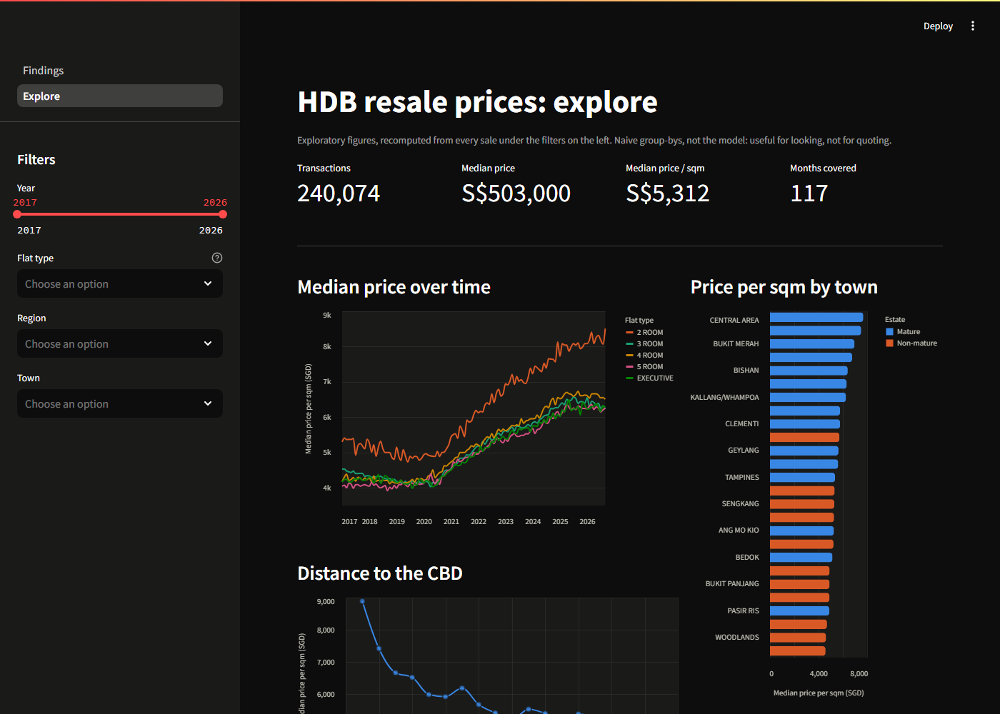
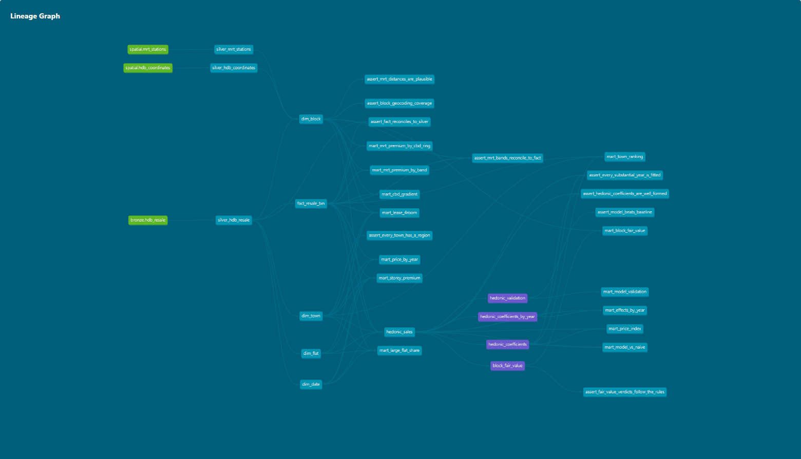
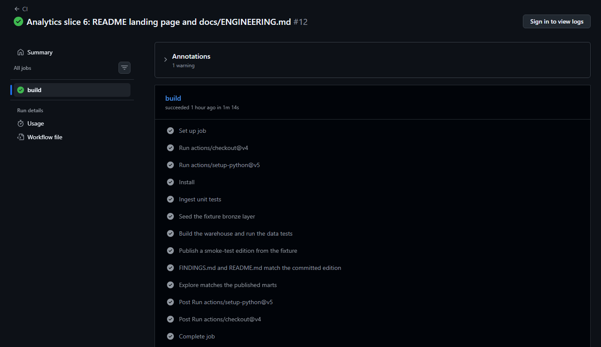

# What really drives HDB resale prices?

[](https://github.com/yahweh9/hdb-resale-pipeline/actions/workflows/ci.yml)

I built this project while learning data analytics. I wanted to practise on a real,
messy dataset rather than a tidy tutorial one, and Singapore's HDB resale records are a
good fit: they're public, updated every month, and easy to relate to.

The question I kept coming back to was simple. When one flat sells for more than
another, how much of that is down to the flat itself (its location, its remaining lease,
its floor) and how much is just down to *which* flats happened to sell? Answering it
properly meant collecting the data, cleaning it, comparing flats like for like, and
checking that the answers hold up.

<!-- edition -->
**Data cut:** resale transactions through **Sep 2026** (240,074 sales) · published **14 Sep 2026**
<!-- /edition -->


---

## What I found

The full write-up, including what each result *can't* tell you, is in
[FINDINGS.md](FINDINGS.md).

- **Living near an MRT station is worth about 19% more per square metre, not 10%.**
  A simple comparison undersells it, because flats far from stations often have other
  things going for them, like a better town or a newer lease.
  ([Finding 2](FINDINGS.md#2-living-near-an-mrt-station-is-worth-more-than-it-first-looks))
- **Older flats looked *more* expensive at first.** That's because the oldest flats are
  in central, mature estates. Comparing like with like, a flat with under 50 years of
  lease left is worth about 43% less than one with 90+ years.
  ([Finding 4](FINDINGS.md#4-older-flats-looked-more-expensive-until-i-compared-like-with-like))
- **A high floor is worth about 20%, not the 83% a simple comparison shows.** Tall
  blocks tend to be newer and in pricier areas.
  ([Finding 3](FINDINGS.md#3-high-floors-cost-more-but-much-less-than-they-seem-to))
- **Prices rose about 57% since 2017, almost all of it after 2020.**
  ([Finding 5](FINDINGS.md#5-prices-rose-by-more-than-half-almost-all-of-it-after-2020))
- **One of my ideas turned out to be wrong**, and I kept it in: buyers in different
  regions did not move to bigger or smaller flats in different ways.
  ([Finding 6](FINDINGS.md#6-an-idea-i-tested-that-turned-out-to-be-wrong))

To check the model wasn't just telling me what I wanted to hear, I tested it on blocks
it had never seen. It priced a typical sale within 6%, compared with 9% for a simple
guess based on the town and flat type
([Finding 7](FINDINGS.md#7-which-blocks-sell-for-more-or-less-than-expected)).

---

## How it works, in plain English

1. **Collect.** A Python script downloads every resale transaction from data.gov.sg.
   Two more add MRT station locations and a map location for every HDB block.
2. **Clean and organise.** The raw data is messy (every column arrives as text, and
   some fields come in two formats), so SQL models in dbt turn it into tidy tables
   stored in DuckDB, a small database that runs on a laptop.
3. **Compare like with like.** A pricing model (a "hedonic" model) works out what each
   feature of a flat is worth while holding everything else the same, a bit like
   working out what cheese adds to a burger by comparing lots of burgers.
4. **Check.** Over 100 automatic data checks, plus tests for the Python code, run
   every time the project changes, so a mistake stops the build instead of reaching the
   results.
5. **Share.** The final numbers are saved into one folder. The dashboard and the
   findings write-up both read from it, so they always show the same numbers.

```
 data.gov.sg · Wikidata · OneMap
              |
              v
     download the raw data
              |
              v
  clean and organise it (dbt + DuckDB)
              |
              v
  compare like with like (pricing model)
              |
              v
  save the published numbers
              |
      +-------+--------+
      v                v
  dashboard       FINDINGS.md
```

---

## Screenshots

**The Explore page.** Filter by year, flat type, region or town and the charts
recalculate.



**How the data flows.** Each box is one step in dbt, from the raw data on the left to
the final published tables and checks on the right.



**The automatic checks passing.** GitHub runs every step on each change: the tests,
building the database, and checking the write-up matches the published numbers.



---

## Try it

The dashboard runs from the published numbers in this repo, so you don't need an API key
or to download anything first:

```bash
pip install -r requirements.txt
streamlit run dashboard.py
```

It has two pages: **Findings**, with the main results, and **Explore**, where you can
filter the data yourself.

---

## Tools I used

Python, SQL, DuckDB, dbt, pandas, statsmodels, Streamlit and GitHub Actions.

Built with the help of an AI coding assistant.

---

## What I'd like to add next

- **Distance to popular primary schools.** Living within 1km of a school matters for
  Primary One registration, so it's probably one of the biggest price factors I'm
  missing.
- **A test of forecasting.** Checking how badly a simple forecast would have done in
  past years, to show why I don't make predictions here.

---

## More detail

| Document | What's in it |
|---|---|
| [FINDINGS.md](FINDINGS.md) | The results, with tables, and what each one can and can't tell you |
| [docs/ENGINEERING.md](docs/ENGINEERING.md) | A deeper, more technical look at how the data is collected, cleaned and tested |
| [docs/ANALYTICS_PLAN.md](docs/ANALYTICS_PLAN.md) | The decisions I made about the model and how the results are published |

Data: [HDB Resale Flat Prices](https://data.gov.sg) (data.gov.sg), MRT station locations
from [Wikidata](https://query.wikidata.org), block locations from
[OneMap](https://www.onemap.gov.sg).
